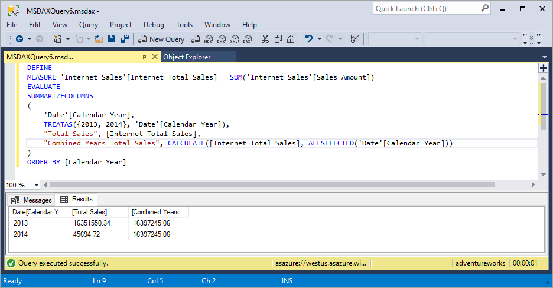

# DAX queries

With DAX queries, you can query and return data defined by a table expression. Reporting clients construct DAX queries whenever a field is placed on a report surface, or a whenever a filter or calculation is applied. DAX queries can also be created and run in [SQL Server Management Studio](https://docs.microsoft.com/sql/ssms/download-sql-server-management-studio-ssms) (SSMS) and open-source tools like [DAX Studio](https://daxstudio.org). DAX queries run in SSMS and DAX Studio return results as a table.

Before learning about queries, it's important you have a solid understanding of DAX basics. If you haven't already, be sure to checkout [DAX overview](dax-overview.md).

## Syntax

```dax
[DEFINE {  MEASURE <tableName>[<name>] = <expression> } 
        {  VAR <name> = <expression>}]
EVALUATE <table>  
[ORDER BY {<expression> [{ASC | DESC}]}[, …]  
[START AT {<value>|<parameter>} [, …]]]  
```

## Keywords

### EVALUATE (Required)

At the most basic level, a DAX query is an **EVALUATE** statement containing a table expression. However, a query can contain multiple EVALUATE statements.

#### Syntax
  
```dax
EVALUATE <table>  
```

#### Arguments

|Term  |Definition  |
|---------|---------|
|  table     |   A table expression.  |

#### Example

```dax
EVALUATE(
    'Internet Sales'
    )
```

Returns all rows and columns from the Internet Sales table, as a table.


### ORDER BY (Optional)

The optional **ORDER BY** keyword defines one or more expressions used to sort query results. Any expression that can be evaluated for each row of the result is valid.  

#### Syntax

```dax
EVALUATE <table>  
[ORDER BY {<expression> [{ASC | DESC}]}[, …]  
```

#### Arguments

|Term  |Definition  |
|---------|---------|
|  expression     |   Any DAX expression that returns a single scalar value.  |
| ASC  | (default) Ascending sort order. |
| DESC  | Descending sort order. |

#### Example

```dax
EVALUATE(
    'Internet Sales'
    )
ORDER BY
    'Internet Sales'[Order Date]
```

Returns all rows and columns from the Internet Sales table, ordered by Order Date, as a table.


### START AT (Optional)

The optional **START AT** keyword is used inside an **ORDER BY** clause. It defines the value at which the query results begin.

#### Syntax

```dax
EVALUATE <table>  
[ORDER BY {<expression> [{ASC | DESC}]}[, …]  
[START AT {<value>|<parameter>} [, …]]]  
```

#### Arguments

|Term  |Definition  |
|---------|---------|
|  value     |   A constant value. Cannot be an expression.  |
|  parameter     |   The name of a parameter in an XMLA statement prefixed with an `@` character.  |
  
START AT arguments have a one-to-one correspondence with the columns in the ORDER BY clause. There can be as many arguments in the START AT clause as there are in the ORDER BY clause, but not more. The first argument in the START AT defines the starting value in column 1 of the ORDER BY columns. The second argument in the START AT defines the starting value in column 2 of the ORDER BY columns within the rows that meet the first value for column 1.  

#### Example

```dax
EVALUATE(
    'Internet Sales'
    )
ORDER BY
    'Internet Sales'[Sales Order Number]
START AT "SO7000"
```

Returns all rows and columns from the Internet Sales table, ordered by Sales Order Number, beginning at SO7000.


Multiple **EVALUATE**/**ORDER BY**/**START AT** clauses can be specified in a single query.

### DEFINE (Optional)

The optional **DEFINE** keyword defines entities that exist only for the duration of the query. Definitions are valid for all EVALUATE statements. Entities can be variables, measures, tables, and columns. Definitions can reference other definitions that appear before or after the current definition. Definitions typically precede the EVALUATE statement. 

#### Syntax
  
```dax
[DEFINE {  MEASURE <tableName>[<name>] = <expression> } 
        {  VAR <name> = <expression>}]
EVALUATE <table>  
```

#### Arguments

|Term  |Definition  |
|---------|---------|
|   tableName     |   The name of an existing table using standard DAX syntax. It cannot be an expression.       |
|   name     |   The name of a new measure. It cannot be an expression.      |
|  expression  |  Any DAX expression that returns a single scalar value. The expression can use any of the defined measures. The expression must return a table. If a scalar value is required, wrap the scalar inside a ROW() function to produce a table.  |
|   VAR     |   An optional expression as a named variable. A [VAR](var-dax.md) can be passed as an argument to other expressions.      |

#### Example

```dax
DEFINE
MEASURE 'Internet Sales'[Internet Total Sales] = SUM('Internet Sales'[Sales Amount])
EVALUATE
SUMMARIZECOLUMNS
(
    'Date'[Calendar Year],
    TREATAS({2013, 2014}, 'Date'[Calendar Year]),
    "Total Sales", [Internet Total Sales],
    "Combined Years Total Sales", CALCULATE([Internet Total Sales], ALLSELECTED('Date'[Calendar Year]))
)
ORDER BY [Calendar Year]
```

Returns the calculated total sales for years 2013 and 2014, and combined calculated total sales for years 2013 and 2014, as a table. The measure in the DEFINE statement, Internet Total Sales, is used in both Total Sales and Combined Years Total Sales expressions.



## Parameters in DAX queries  

A well-defined DAX query statement can be parameterized and then used over and over with just changes in the parameter values.  
  
The [Execute Method (XMLA)](https://docs.microsoft.com/bi-reference/xmla/xml-elements-methods-execute) method has a [Parameters Element (XMLA)](https://docs.microsoft.com/bi-reference/xmla/xml-elements-properties/parameters-element-xmla) collection element that allows parameters to be defined and assigned a value. Within the collection, each [Parameter Element (XMLA)](https://docs.microsoft.com/bi-reference/xmla/xml-elements-properties/parameter-element-xmla) element defines the name of the parameter and a value to it.  
  
Reference XMLA parameters by prefixing the name of the parameter with an `@` character. Hence, any place in the syntax where a value is allowed it can be replaced with a parameter call. All XMLA parameters are typed as text.  
  
> [!IMPORTANT]
> Parameters defined in the parameters section and not used in the **&lt;STATEMENT&gt;** element generate an error response in XMLA.

> [!IMPORTANT]
> Parameters used and not defined in the **&lt;Parameters&gt;** element generate an error response in XMLA.
  
## See also

[FILTER](filter-function-dax.md)  
[SUMMARIZECOLUMNS](summarizecolumns-function-dax.md)  
[TREATAS](treatas-function.md)  
[VAR](var-dax.md)
