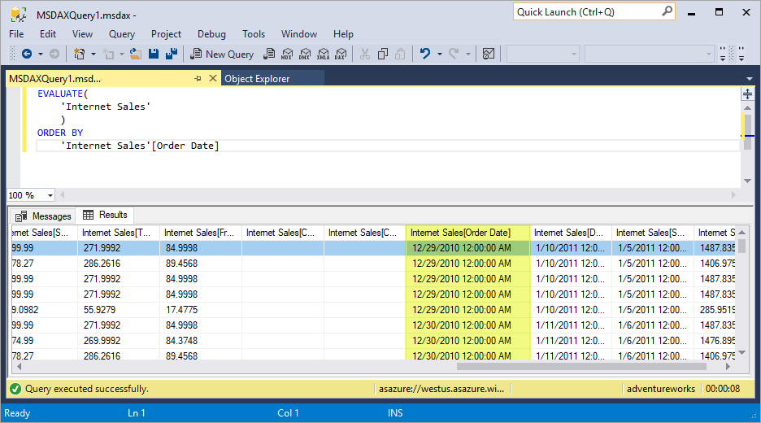

# DAX queries

With DAX queries, you can retrieve data defined by a table expression from the in-memory analytics engine (VertiPaq). You can create measures as part of the query; these measures exist only for the duration of the query. DAX queries can be created and run in SQL Server Management Studio and open-source tools like DAX Studio (daxstudio.org).
  
## Syntax  
  
```dax
[DEFINE {  MEASURE <tableName>[<name>] = <expression> } 
        {  VAR <name> = <expression>}]
EVALUATE <table>  
[ORDER BY {<expression> [{ASC | DESC}]}[, …]  
[START AT {<value>|<parameter>} [, …]]]  
```
  
## Parameters 

**DEFINE** - clause
An optional clause that defines measures for the duration of the query. Definitions can reference other definitions that appear before or after the current definition.  
 
Arguments


|Term  |Definition  |
|---------|---------|
|tableName     |   The name of an existing table using standard DAX syntax. It cannot be an expression.       |
|name     |   The name of a new measure. It cannot be an expression.      |
|VAR     |   An optional expression as a named variable. A VAR can be passed as an argument to other expressions.      |
|  expression  |  Any DAX expression that returns a single scalar value. |

  
**EVALUATE** clause  
Contains the table expression that generates the results of the query. The expression can use any of the defined measures.  
  
The expression must return a table. If a scalar value is required, the person authoring the measure can wrap their scalar inside a ROW() function to produce a table that contains the required scalar.  
  
**ORDER BY** clause  
Optional clause that defines the expression(s) used to sort the query results. Any expression that can be evaluated for each row of the result is valid.  
  
**START AT** sub-clause  
Optional clause, inside an **ORDER BY** clause, that defines the values at which the query results will start. The **START AT** clause is part of the **ORDER BY** clause and cannot be used outside it.  
  
In an ordered set of results, the **START AT** clause defines the starting row for the result set.  
  
The **START AT** arguments have a one to one correspondence with the columns in the ORDER BY clause; there can be as many arguments in the START AT clause as there are in the ORDER BY clause, but not more. The first argument in the **START AT** defines the starting value in column 1 of the **ORDER BY** columns. The second argument in the **START AT** defines the starting value in column 2 of the **ORDER BY** columns within the rows that meet the first value for column 1.  

Multiple **EVALUATE**/**ORDER BY**/**START AT** clauses can be specified in a single query.
  
**value**
A constant value; it cannot be an expression.  
  
**parameter**  
The name of a parameter in the XMLA statement prefixed with an **@** character. 

**summarize** - function
The DAX [SUMMARIZE](summarize-function-dax.md) function is similar to the T-SQL GROUP BY 


### Return value  

A table of data.  

## Examples

### Example 1
```DAX
EVALUATE(
    FactInternetSales
    )
```
### Returns    
All rows and columns from the FactInternetSales table, as a table.


### Example 2
```DAX
EVALUATE(
FILTER(
DimGeography
, DimGeography[StateProvinceName]="California")
)
order by
DimGeography[GeographyKey]
```

### Returns    
All rows and columns from the DimGeography table, where StateProvinceName is equal to California, ordered by GeographyKey, as a table.



## Parameters in XMLA and DAX queries  

A well-defined DAX query statement can be parameterized and then used over and over with just changes in the parameter values.  
  
The [Execute Method (XMLA)](https://msdn.microsoft.com/en-us/0fff5221-7164-4bbc-ab58-49cf04c52664) method in XMLA has a [Parameters Element (XMLA)](https://msdn.microsoft.com/en-us/d46454a1-a1d1-4aa8-95ea-54be22a53e83) collection element that allows parameters to be defined and assigned a value; within the collection, each [Parameter Element (XMLA)](https://msdn.microsoft.com/en-us/fe31ac3d-a3e8-4f60-a81a-c43271ddbed4) element defines the name of the parameter and a value to it.  
  
The DAX query syntax allows you to reference XMLA parameters by prefixing the name of the parameter with an **@** character. Hence, any place in the syntax where a value is allowed it can be replaced with a parameter call. Keep in-mind all XMLA parameters are typed as text.  
  
> [!IMPORTANT]  
> Parameters defined in the parameters section and not used in the **&lt;STATEMENT&gt;** element generate an error response in XMLA.  
  
> [!IMPORTANT]  
> Parameters used and not defined in the **&lt;Parameters&gt;** element generate an error response in XMLA.  
  
## Reference  
  
-   [Execute Method (XMLA)](https://msdn.microsoft.com/en-us/0fff5221-7164-4bbc-ab58-49cf04c52664)  
  
-   [Statement Element (XMLA)](https://msdn.microsoft.com/en-us/bfedc03c-d476-4d55-b5fd-36169f01351a)  
  